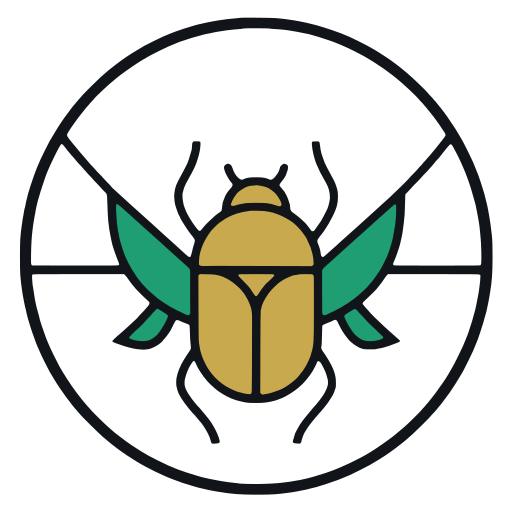
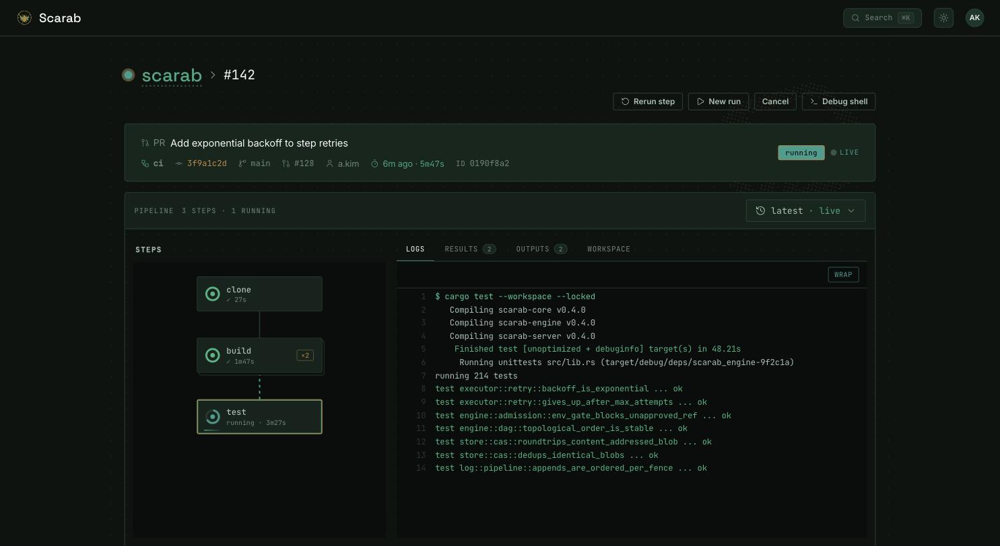

<div align="center">

<picture>
  <source media="(prefers-color-scheme: dark)" srcset="ui/brand/logo/scarab-emblem-dark-square.svg">
  
</picture>

# Scarab

**A modern CI engine for Kubernetes — forge-native, on a durable core.**

A forge-native CI with the batteries included, on an engine that treats a run
as durable **state** — so a control-plane restart resumes it, never restarts it.
Written in Rust.

<br>

[](LICENSE)
[](#building)
[](docs/adr/0005-tenancy-and-k8s-only.md)
[](#status-honest)

[Context](CONTEXT.md) · [ADRs](docs/adr/) · [Positioning](docs/positioning.md) · [Run it locally](#local-dev-cluster-free)

</div>

---

<div align="center">


<sub>The dashboard: an **action inbox** of runs suspended on a gate, **recently-visited repos** as pass/fail status cards, and the recency-sorted repo list. ⌘K to jump anywhere.</sub>

</div>

CI tools fall into two camps, and neither covers the whole job. **Workflow engines** — Argo,
Tekton, Temporal — have a durable, crash-safe core, but they aren't CI: the forge
integration, in-repo config, PR checks, identity, secrets, DSL, and UI are yours to build.
**Forge-native CIs** — GitHub Actions, GitLab, Woodpecker, Drone — hand you all of that, but
the orchestrator underneath is a job runner: if the control plane restarts mid-run, the run
is orphaned or starts from scratch.

Scarab is built to be **both at once** — the batteries-included feel of a forge-native CI, on
a control plane that treats a run as durable **state**, not a fire-and-forget process. The
engine is a crash-safe state machine on Postgres (the DBOS/Temporal pattern): a control-plane
restart resumes the run from its last completed step, with exactly-once step execution. Where
self-hosted CIs like Woodpecker and Drone strand in-flight builds on a restart — stuck
`running`, containers left dangling ([woodpecker-ci#3427](https://github.com/woodpecker-ci/woodpecker/issues/3427),
[drone#2189](https://github.com/harness/drone/issues/2189)) — a Scarab run picks up where it
left off.

Durability is the *architecture*, not the headline: resume, restart-a-step, durable approval
gates, and an inspectable event log all fall out of it. It earns its keep as pipelines get
longer and more autonomous — agents, multi-day workflows, long review gates — where "the job
died, click re-run" stops being good enough: Scarab holds a suspended run at near-zero cost
and resumes exactly where it paused.

**Lineage.** Scarab owes its shape to [Woodpecker](https://woodpecker-ci.org/) — lean,
forge-native CI, no enterprise ceremony — and is inspired as much by its *limits*: the
many-backend surface it carries, and the pace a volunteer project can sustain. Kubernetes-only
sheds the backend baggage on purpose; the
pace is what a small team building AI-first can now hold.

## Status (honest)

Read this as *a proven core with the live-I/O edges being wired*, not a shipped product.

- **Proven (against real Postgres).** The durable engine: crash-mid-run → resume, exactly-once
  step execution, restart-a-step, durable gates, content-addressed workspace, `invoke`
  inlining, scheduler (concurrency/fairness/supersede), secrets + fork-PR lockout, and a
  self-hosted OIDC issuer. The workspace test suite passes locally.
- **Proven against a *fake* forge.** The forge-native flow end-to-end: signed webhook →
  in-repo `.scarab` config → run → checks posted back → OAuth-gated reads.
- **Implemented, not yet battle-tested against a live forge.** Two real forge adapters —
  GitHub (`/webhooks/github`) and Forgejo (`/webhooks/forgejo`) — each with HMAC webhook
  ingest and commit-status posting over real HTTP (multi-adapter). The end-to-end
  loop against a live forge is wired but not yet hardened.
- **In progress.** Live-Kubernetes Pod execution and re-attach (tested only via `#[ignore]`d
  live-cluster paths), the results-egress sidecar image, and a CI job that runs the Rust
  suite on push.

So: the hard core (the durable state machine) is real and tested; the claims scoped to *a
live forge* and *a live cluster* are not yet demonstrated. Implementation proceeds in
tracer-bullet vertical slices. See [docs/positioning.md](docs/positioning.md) for what we do
and don't claim, and why.

## Documentation

The full docs site — **[docs.scarab](https://thulasi-ram.github.io/scarab-ci/)** — is built
with Astro Starlight and published to GitHub Pages on tag. It carries the
getting-started guides, the pipeline authoring/config reference, the generated OpenAPI, and
all ~40 ADRs. In-repo, the same sources live under:

- **[CONTEXT.md](CONTEXT.md)** — the thesis, the durability contract, non-goals, and the
  **ubiquitous language** every crate/API/UI must use.
- **[docs/adr/](docs/adr/)** — ~40 Architecture Decision Records (the *why* behind every
  load-bearing choice).
- **[docs/positioning.md](docs/positioning.md)** — what we do and don't claim, and why.
- **Issues** — tracked in [git-bug](https://github.com/git-bug/git-bug) (embedded in this
  repo): `git-bug bug` to list, `git-bug termui` for the TUI.

## The run view

<div align="center">



<sub>A run is durable **state**: the step DAG, live logs, and an append-only event timeline —
here a flaky step auto-retried, then the run parked on a manual <code>deploy-prod</code> gate,
held at near-zero cost until someone approves.</sub>

</div>

## What makes it different

|  |  |
|---|---|
| **Cohesion, not assembly** | One forge-native CI product — DSL, secrets, approvals, identity, UI — on a durable engine. Not a workflow engine you build a CI on top of, nor a job-runner CI with no durable core. |
| **Runs are state, not processes** | A DBOS-pattern durable state machine on Postgres. A control-plane restart resumes the run from its last completed step, with exactly-once step execution — the architecture, not a boast. |
| **Keyless identity** | Forge-agnostic OIDC, with Scarab itself as an OIDC issuer for keyless federation to your cloud. *(GitHub + Forgejo adapters implemented; the live-forge loop is not yet hardened — see Status.)* |
| **A real DSL** | A typed IR (the actual DSL) with a YAML frontend and CEL expressions — a flat recursive DAG where `invoke` is reuse and matrix is a modifier. |

The durable core is the *architectural* wedge —
the thing every other decision is judged against — but the *public* pitch is the cohesion. See
[docs/positioning.md](docs/positioning.md) for how we talk about it, and the honest boundaries.

## Design at a glance

| Aspect | Choice |
|---|---|
| Substrate | DBOS-pattern durable state machine on **Postgres** (Rust); object store for blobs |
| Execution | **Pod-per-step**, content-addressed workspace (per-file merkle CAS); k8s-only |
| Ontology | **Flat recursive DAG** (`Pipeline → Step`); `invoke` = reuse; matrix = modifier |
| DSL | Typed **IR** (the real DSL) + YAML frontend + **CEL** expressions |
| API | **REST/OpenAPI + SSE** (dogfooded by UI & CLI) + internal gRPC |
| Code | **Hexagonal**, compiler-pure domain crates + per-vendor adapter crates; one converged binary |
| Security | Forge-agnostic OIDC identity; **Scarab as OIDC issuer** for keyless federation |
| UI | SolidJS + generated OpenAPI client |

## Workspace layout

```
CONTEXT.md            ubiquitous language + system overview
docs/adr/             architecture decision records
crates/
  scarab-engine       durable core (pure): DAG state machine, scheduler, ports
  scarab-pipeline     IR, YAML→IR, CEL, validation (pure)
  scarab-forge        ForgePort + canonical Event/Status (pure)
  scarab-identity     Authenticator, OidcIssuer, RBAC (pure)
  scarab-secrets      SecretProvider (pure)
  scarab-storage      ObjectStore + Cas (pure)
  scarab-project      Org/Repo/Project/Environment (pure)
  scarab-db-postgres · scarab-secrets-postgres · scarab-storage-s3   state/blob adapters
  scarab-executor-{k8s,local} · scarab-forge-{github,forgejo}        exec/forge adapters
  scarab-testkit      fakes: FakeClock / InMemoryDb / FakeExecutor
  scarab-server       composition root: axum + OpenAPI + SSE; role runner
  scarab-cli          CLI (generated from OpenAPI)
```

## Building

```sh
cargo check --workspace
cargo run -p scarab-server -- --help
```

## Local dev

Config for the local stack lives in `deploy/local-proc/.env` — gitignored (env
files may hold secrets), seeded from the committed `deploy/local-proc/.env.example`
the first time you run a recipe. Edit your copy to customise. A root `.env.local`
can hold optional per-machine overrides (e.g. a dev `SCARAB_ADDR`) — it's
gitignored and loaded by your shell/direnv, not by the recipes themselves. Real
secrets for the in-cluster dogfood live in its own gitignored
`deploy/local-helm/.env`.

```sh
just ui       # Vite dev server on http://localhost:5173, proxies /v1 → server
just serve    # scarab-server in the foreground against the dev stack (needs `just up`)
```

Every knob (`SCARAB_ADDR`, `SCARAB_DATABASE_URL`, `SCARAB_S3_*`, `SCARAB_API_URL`,
…) comes from that file — point elsewhere by editing it. Auth is disabled in dev
(`SCARAB_DEV_INSECURE=1`), so every request is an Owner.

## Full dev stack (k8s)

One command brings up the two stateful dependencies (Postgres + MinIO), a
[kind](https://kind.sigs.k8s.io/) cluster for step Pods, and `scarab-server` in
converged mode, then submits a pipeline and watches it complete:

```sh
just up      # Postgres + MinIO (docker compose) + kind + scarab-server (background)
just demo    # POST a one-step pipeline, poll until it succeeds, print logs
just down    # tear it all down
```

Requires `docker`, `kind`, `kubectl`, `cargo`, and `python3`. The kind cluster's
kubeconfig is written to `deploy/local-proc/.kubeconfig` and used only via
`KUBECONFIG`, so Scarab never touches an ambient (e.g. production) context.
Postgres is published on **55432** to avoid clashing with a host Postgres on
5432. Config is entirely env-driven (`SCARAB_DATABASE_URL`, `SCARAB_S3_*`,
`KUBECONFIG`, `SCARAB_NAMESPACE`) — see `Justfile` and `deploy/local-proc/`.

Without Docker/kind, the server still runs API-only against a local Postgres and
a filesystem object store (`--object-dir`); the background driver is skipped
until a cluster is reachable.

## Helm dogfood (in-cluster, colima)

To exercise the **real chart + published image** in-cluster (prod-shaped, e.g.
Scarab-on-Scarab), use the `local-helm` mode:

```sh
just local-helm             # pull + deploy the latest ghcr `edge`
just local-helm sha-<sha>   # pull + deploy a specific published SHA
just local-helm local       # build server+clone+sidecar+wsfetch from the tree, then deploy
```

Needs `deploy/local-helm/.env` and kube context `colima`; see
`deploy/local-helm/README.md`.

> **Running or testing Scarab locally: use the `just` recipes as the canonical
> entrypoints** (`just up`/`demo`/`down`, `just local-helm`, `just test`) rather
> than hand-rolled `docker`/`kubectl`/`helm` commands — they carry the right
> env, isolated kubeconfig, image source, and colima guards. Missing something?
> Add a recipe. (Agents: this is also in `CLAUDE.md`.)

## API contract workflow

`openapi.json` (committed at the repo root) and the generated TS client
(`ui/scarab-web-ui/src/api/schema.ts`) are **gated against drift in CI** —
the build fails if either is stale. After changing any route or DTO:

```sh
cargo run -p scarab-server -- --emit-openapi openapi.json
cd ui/scarab-web-ui && npm run gen && npm run typecheck
```

Full-route coverage is enforced by the test
`every_registered_route_is_in_the_openapi_spec` — a new `.route(...)` without
a `#[utoipa::path]` annotation fails the suite.

## License

[GNU Affero General Public License v3.0](LICENSE) (`AGPL-3.0-only`). Running a
modified Scarab as a network service obliges you to offer users its source.

## References

- [ADR-0001 — CI as durable execution (the wedge)](docs/adr/0001-ci-as-durable-execution.md)
- [ADR-0005 — Tenancy & deployment; Kubernetes as the only backend](docs/adr/0005-tenancy-and-k8s-only.md)
- [ADR-0040 — Documentation site: Astro Starlight, in-repo, DESIGN.md-branded](docs/adr/0040-documentation-site.md)
- [ADR-0046 — Forge auth is adapter-internal; GitHub + Forgejo adapters in v1](docs/adr/0046-forge-auth-and-multi-adapter.md)
- [ADR-0054 — Product surface: embedded UI, run cancellation, API/CLI truthfulness](docs/adr/0054-product-surface-serving.md)
