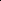
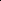

import Doodle from '../../../components/Doodle.astro';

<Doodle icon="git-branch" size={210} rotate={-12} opacity={0.18} top="7rem" right="-2rem" />

## The model, in brief

A Scarab pipeline is a **flat recursive DAG** (`Pipeline → Step`). The real DSL is a **typed IR**;
YAML is a frontend and **CEL** provides expressions.

- **`invoke`** is reuse — compile-time inlining of a library pipeline into the caller's DAG.
- **`matrix`** is a modifier that fans a step out over a set of inputs.
- A **step** is an OCI image plus a contract.

Compilation is **static**: the whole DAG — every matrix combination, every inlined library step — is
materialised and validated at submit time, so a cycle, a dangling `needs`, or an empty matrix
dimension is rejected up front, never discovered mid-run. Start from
[Run locally](/scarab-ci/get-started/run-locally/) to submit your first pipeline.

## Where pipelines live

A repo's CI lives in `.scarab/`. A triggered pipeline is a YAML file such as `.scarab/ci.yaml`;
its file name is the default display name (`ci.yaml` reads as `ci`, overridable with a top-level
`name:`). Reusable **library** pipelines live under `.scarab/lib/` and are pulled in with `invoke`
(see [Reuse with `invoke`](#reuse-with-invoke)).

A minimal pipeline is an `on:` block and a list of `steps`:

```yaml
on:
  push: {}
  pull_request: {}

steps:
  - id: checkout
    clone: {}

  - id: check
    image: rust:1-bookworm
    needs: [checkout]
    command: ["cargo", "check"]
```

## Triggers — `on:`

`on:` maps a trigger kind to a filter. The kinds Scarab understands are `push`, `pull_request`,
`tag`, `release`, `comment`, `cron`, `manual`, `api`, and `upstream`. An empty `on:` means the
pipeline has no automatic triggers — it runs only when launched explicitly.

```yaml
on:
  push: {}
  pull_request: {}
```

Each kind takes an optional `when:` CEL guard over the event context, so a trigger can fire
selectively:

```yaml
on:
  push:
    when: "event.branch == 'main'"
```

**Manual dispatch is opt-in**: a pipeline is dispatchable from the UI/API only if it declares
`on: manual`. The trigger context also feeds each run's provenance and **Headline** — the trigger
title shown against the run.

```yaml
on:
  manual: {}
  push: {}
```

## Launch parameters — `interface.inputs`

A pipeline declares its typed launch parameters under `interface.inputs`. This is the same
interface an `invoke` caller satisfies with `with:` — one contract for both launching and reuse. A
bare string is shorthand for a required string; the map form is fully typed:

```yaml
on:
  manual: {}

interface:
  inputs:
    - { name: region, type: choice, options: [us-east-1, eu-west-1], description: "target region" }
    - { name: replicas, type: number, required: false, default: 2 }
    - { name: force, type: boolean, required: false, default: false }

steps:
  - id: ship
    image: busybox
    command: ["deploy", "${{ inputs.region }}", "n=${{ inputs.replicas }}"]
```

- `type` is one of `string` (default), `boolean`, `number`, `choice`. A `choice` needs a non-empty
  `options` list.
- `required` defaults to `true`. An optional parameter (`required: false`) **must** carry a
  `default`, keeping the resolved parameter set total.
- An optional `validate:` CEL predicate over the resolved value (bound as `value`) rejects a bad
  launch fail-closed.

Resolved parameters are read in steps as `${{ inputs.<name> }}` and are also injected into the
step environment as `SCARAB_PARAM_<NAME>`.

## Steps — image, command, and the built-in kinds

The step contract is an OCI `image` plus a `command`; everything else is a modifier. `env` is a list
of `[NAME, VALUE]` pairs; `artifacts` publishes globs of files the step wrote to `/scarab/artifacts/`.

```yaml
- id: check
  image: rust:1-bookworm
  needs: [checkout]
  env:
    - [CARGO_TARGET_DIR, /tmp/scarab-target]
  command:
    - bash
    - -c
    - |
      set -euxo pipefail
      cargo check
      mkdir -p /scarab/artifacts
      rustc --version > /scarab/artifacts/toolchain.txt
  artifacts:
    - "*.txt"
```

Some steps are image-less **kinds** the engine runs on your behalf (you set no `image`/`command`):

- **`clone: {}`** — source provisioning (see [Getting source](#getting-source)).
- **`build: { image: ..., push: true }`** — a rootless BuildKit image build.
- **`gate: manual`** — a durable approval/wait point (see [Environments, secrets & gates](#environments-secrets--gates)).
- **`invoke: .scarab/lib/...`** — compile-time reuse (see [Reuse with `invoke`](#reuse-with-invoke)).

### Getting source — the `clone` step

Source is provisioned by a first-class **`clone` step**. It is zero-config by design: the repo,
ref, resolved SHA, and token all come from the run's trigger context, so `clone: {}` is the common
case. Downstream steps inherit the cloned workspace through ordinary `needs`.

```yaml
- id: checkout
  clone: {}          # depth 1, current ref pinned to its SHA

- id: full
  clone:
    depth: full      # complete history (`1` is the shallow default)
    submodules: true
    lfs: true
```

Scarab is multi-forge — GitHub and Forgejo are both supported adapters; the `clone` step is
identical across them.

## Wiring steps — `needs`, `matrix`, and `when`

`needs:` declares the DAG edges. A step runs once all of its needs succeed and inherits their
workspaces. A `when:` CEL guard skips a step whose predicate is false; expressions read the run's
context (e.g. `event`, and any `matrix` coordinate):

```yaml
- id: deploy
  image: deployer
  needs: [build]
  when: "event.branch == 'main'"
```

**`matrix`** fans one authored step into the cartesian product of its dimensions, expanded
statically at submit time. An `exclude` list of
CEL predicates (evaluated against each combination's own coordinate) drops combinations:

```yaml
- id: test
  image: rust:1-bookworm
  matrix:
    dimensions:
      os: [linux, windows]
      arch: [amd64, arm64]
    exclude:
      - "os == 'windows' && arch == 'arm64'"
```

Each instance gets a deterministic id like `test[arch=amd64,os=linux]`, and a downstream
`needs: [test]` fans in over every surviving instance.

## Reuse with `invoke`

`invoke` inlines a **library** pipeline (under `.scarab/lib/` by convention) into the caller's DAG
at compile time — not a runtime call.
It is local-only forever: repo-relative paths, read at the caller's ref; no `../` escape and no
cross-repo references (cross-repo causation is `on: upstream`). The invoked steps are id-namespaced
by the invoke step's id (`deploy/plan`, `deploy/url`), and `matrix` on an invoke step fans out the
whole subgraph.

A library declares its contract with `interface` — the `inputs` it requires and the `outputs` it
exposes — and the caller supplies inputs with `with:`:

```yaml
# .scarab/lib/deploy.yaml
interface:
  inputs:  [region, replicas]
  outputs: [url]
steps:
  - { id: plan, image: tf, command: ["plan"] }
  - { id: url,  image: tf, command: ["apply"], needs: [plan] }
```

```yaml
# .scarab/ci.yaml
steps:
  - id: deploy
    invoke: .scarab/lib/deploy.yaml
    with: { region: us-east-1, replicas: "3" }

  - id: notify
    image: busybox
    needs: [deploy]
    command: ["echo", "${{ outputs.deploy.url }}"]
```

The interface is validated at compile: every required input present, no unknown extras, and every
referenced output declared. Supplied inputs reach each inlined step as `SCARAB_PARAM_<NAME>`.

## Passing data — named results & interpolation

A step publishes **named, typed results** that a downstream step reads at launch via
`${{ outputs.<step-id>.<name> }}`.
Interpolation is resolved at launch time against the upstream step's captured results, so a
consumer must `needs:` the producer:

```yaml
- id: notify
  image: busybox
  needs: [deploy]
  command: ["echo", "${{ outputs.deploy.url }}"]
```

Result capture is transparent to authors: on Kubernetes a per-Pod egress sidecar drains each step's
results back to the control plane — nothing to wire up in the pipeline.

## Environments, secrets & gates

Referencing a top-level `environment:` makes the pipeline a **deploy**: its runs are enforced against
that environment's protection rules at admission.



```yaml
environment: prod

steps:
  - id: ship
    image: deployer
    secrets: [DEPLOY_TOKEN]
    command: ["./deploy.sh"]
```

**Secrets** are named on a step with `secrets: [KEY, ...]`. Each key is resolved against the run's
scope with `env → repo → org` inheritance and
injected as an environment variable of the same name. A fork-PR run is locked out and receives none.



**Gates** are image-less durable suspend points — `gate: manual` is an approval, `gate: timer` waits
`gate_after` seconds, `gate: external` releases via API/webhook. Placed before a deploy step, a
manual gate is the approval mechanism for a governed environment:

```yaml
- id: approve
  gate: manual
  needs: [build]

- id: release
  image: deployer
  needs: [approve]
```

## Placement & resources

By default steps land on the operator's `default` placement profile. An author targets scheduling by
**naming profiles** — never raw Kubernetes — via `placement_profiles`, and requests exact compute
with `resources`:

```yaml
- id: heavy
  image: builder
  placement_profiles: [arm64, critical]
  resources: { cpu_millis: 8000, memory_mib: 16384 }
```

For a rare dynamic per-job Kubernetes need there is a governed `k8s_overlay` escape hatch — a raw
pod-spec fragment merged last onto the Pod. It carries no authority: it is admitted only if the run's
target environment permits raw overlays, else the run is rejected fail-closed. Prefer a named
profile for anything static.

```yaml
- id: heavy
  image: builder
  k8s_overlay:
    spec:
      schedulerName: my-scheduler
```

Privilege above the hardened baseline is requested per step under `security:`. `run_as_root` is
self-service (root
inside the caps-dropped, unprivileged sandbox does not escape it); `add_capabilities` and
`privileged` are governed and take effect only if the environment whitelists the image digest.

```yaml
- id: check
  image: rust:1-bookworm      # its USER is root
  security:
    run_as_root: true
```

## Retries, timeouts & reruns

A step may set a `timeout:` (seconds) and an opt-in `retry:` policy. Retry is
**at-least-once** — declaring it is your assertion that the step is idempotent or fenced; a
non-cooperating side effect will double-fire.

```yaml
- id: flaky
  image: tester
  timeout: 600
  retry: { on: failure, max: 3 }
```

Human-initiated re-execution is modelled as **Takes**: a *rerun* re-executes a run from
the top, a *retry* resumes from a failed step, and an earlier attempt becomes *superseded* or
*shadowed* by the newer one. These are run-history concepts surfaced in the UI — there is nothing to
author for them.

## References

- [ADR-0006 — Pipeline ontology: flat recursive DAG](/scarab-ci/tech/adr/0006-pipeline-ontology/)
- [ADR-0008 — Step contract: OCI image + convention + built-in kinds](/scarab-ci/tech/adr/0008-step-contract/)
- [ADR-0009 — DSL: typed Pipeline IR + YAML frontend + CEL](/scarab-ci/tech/adr/0009-dsl-ir-yaml-cel/)
- [ADR-0014 — Secrets: envelope-encrypted Postgres + pluggable providers](/scarab-ci/tech/adr/0014-secrets/)
- [ADR-0018 — Container image building: rootless BuildKit](/scarab-ci/tech/adr/0018-image-building/)
- [ADR-0023 — DAG shape: static matrix v1, dynamic reserved](/scarab-ci/tech/adr/0023-dag-shape/)
- [ADR-0037 — Environment governance: scoped secrets, approval-as-gate, admission at point-of-use](/scarab-ci/tech/adr/0037-environment-governance/)
- [ADR-0038 — `invoke` is compile-time inlining; local reuse via `.scarab/lib`](/scarab-ci/tech/adr/0038-invoke-and-local-reuse/)
- [ADR-0039 — Privileged step images: hardened baseline + governed capability grants](/scarab-ci/tech/adr/0039-privileged-images/)
- [ADR-0041 — Named step results + launch-time interpolation](/scarab-ci/tech/adr/0041-named-results-and-interpolation/)
- [ADR-0042 — Trusted per-Pod egress sidecar → fence-scoped results API → Postgres](/scarab-ci/tech/adr/0042-trusted-egress-sidecar/)
- [ADR-0043 — Launch parameters + manual dispatch as a repo-aware trigger](/scarab-ci/tech/adr/0043-launch-parameters-and-manual-dispatch/)
- [ADR-0045 — Source provisioning: the `clone` step kind](/scarab-ci/tech/adr/0045-source-provisioning/)
- [ADR-0046 — Forge auth is adapter-internal; GitHub + Forgejo adapters in v1](/scarab-ci/tech/adr/0046-forge-auth-and-multi-adapter/)
- [ADR-0047 — Retry classification, attempt/fence model, and dead-letter](/scarab-ci/tech/adr/0047-retry-classification-and-attempt-model/)
- [ADR-0052 — Artifacts: a dedicated per-run store, convention-emitted](/scarab-ci/tech/adr/0052-artifacts/)
- [ADR-0055 — Placement profiles: named profiles + baseline + governed `k8s_overlay`](/scarab-ci/tech/adr/0055-placement-profiles/)
- [ADR-0056 — Run Takes and attempt-grain evidence](/scarab-ci/tech/adr/0056-run-takes-and-attempt-grain-evidence/)
- [ADR-0057 — Run provenance: trigger context and origin details](/scarab-ci/tech/adr/0057-run-provenance-trigger-context/)
