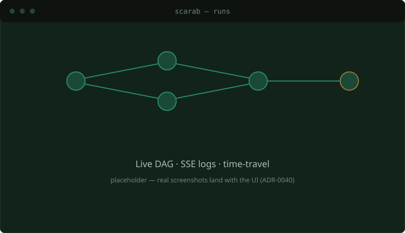

import { Card, CardGrid } from '@astrojs/starlight/components';
import Doodle from '../../components/Doodle.astro';

<Doodle icon="bug" size={260} rotate={-14} opacity={0.07} top="6rem" right="-3rem" />

CI tools fall into two camps. **Workflow engines** — Argo, Tekton, Temporal — have a durable,
crash-safe core, but they aren't CI: forge integration, in-repo config, PR checks, identity,
secrets, DSL, and UI are yours to build. **Forge-native CIs** — GitHub Actions, GitLab,
Woodpecker, Drone — hand you all of that, but the orchestrator is a job runner: if the control
plane restarts mid-run, the run is orphaned or starts over. Scarab is built to be **both at
once** — the batteries-included feel of a forge CI, on a control plane that treats a run as
durable **state**, not a fire-and-forget process.

## What makes it different

<CardGrid>
  <Card title="Cohesion, not assembly" icon="puzzle">
    One forge-native CI product — DSL, secrets, approvals, identity, UI — on a durable engine.
    Not a workflow engine you build a CI on top of, nor a job-runner CI with no durable core.
  </Card>
  <Card title="Runs are state, not processes" icon="approve-check">
    A DBOS-pattern durable state machine on Postgres. A control-plane restart resumes the run
    from its last completed step, with exactly-once step execution — the architecture, not a boast.
  </Card>
  <Card title="Keyless identity" icon="seti:lock">
    Forge-agnostic OIDC, with Scarab itself as an OIDC issuer for keyless federation to your
    cloud. (Designed forge-native; the live GitHub adapter is in progress — see Status.)
  </Card>
  <Card title="A real DSL" icon="seti:config">
    A typed IR (the actual DSL) with a YAML frontend and CEL expressions — a flat recursive DAG
    where <code>invoke</code> is reuse and matrix is a modifier.
  </Card>
</CardGrid>

<Doodle icon="workflow" size={200} rotate={12} opacity={0.06} bottom="2rem" left="-2rem" />

## Why now

As pipelines get longer and more autonomous — agents, long review gates, multi-day workflows —
"the job died, click re-run" stops being good enough. Scarab holds a suspended run at near-zero
cost and resumes exactly where it paused, with an append-only event log of everything that
happened. That's where a durable core earns its keep — and it's the substrate agent-driven
development wants, not a nicer YAML dialect. Scarab is also *built* AI-first: ambitious systems
software from a small team, at a pace that used to need a room full of people.

:::tip[Lineage]
Scarab owes its shape to [Woodpecker](https://woodpecker-ci.org/) — lean, forge-native CI with
no enterprise ceremony. It's inspired at least as much by Woodpecker's *limits*: the many-backend
surface it carries, and the pace a volunteer project can sustain. Kubernetes-only is us shedding
that backend baggage on purpose ([ADR-0005](/scarab-ci/tech/adr/0005-tenancy-and-k8s-only/)); the
pace is what a small AI-first team can now hold.
:::

## Where to go next

<CardGrid>
  <Card title="Run it locally" icon="rocket">
    Bring up Postgres + MinIO + a kind cluster and watch a pipeline complete — [Run
    locally](/scarab-ci/get-started/run-locally/).
  </Card>
  <Card title="Read the design" icon="open-book">
    The thesis, the durability contract, and the ubiquitous language live in the
    [Tech](/scarab-ci/tech/context/) section — 40+ ADRs on the *why* behind every choice.
  </Card>
</CardGrid>

:::note[Status — honest]
A proven core, with the live-I/O edges being wired. **Proven against real Postgres:** the durable
engine — crash/resume, exactly-once, restart-a-step, gates, content-addressed workspace,
`invoke`, secrets, OIDC issuer (~230 tests). **Proven against a *fake* forge:** the full flow
(webhook → in-repo `.scarab` → run → checks → login). **In progress:** the live GitHub adapter
(outbound calls are `unimplemented!()` today), live-Kubernetes Pod execution, the results sidecar
image, and CI that runs the Rust suite on push. Read a proven state machine, not a shipped product.
:::
