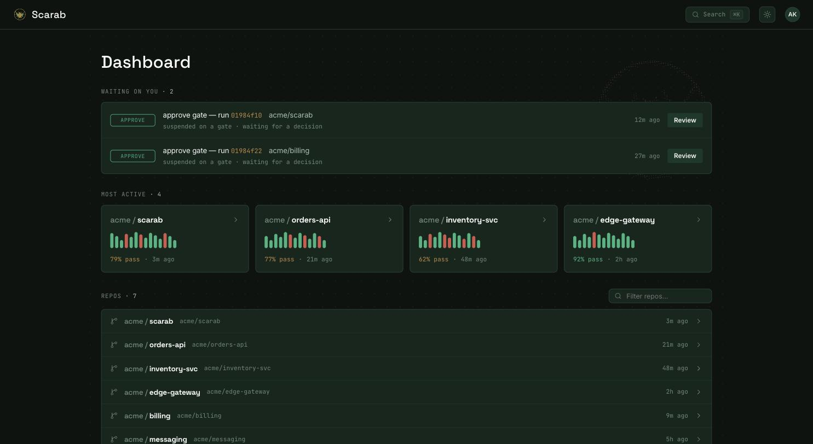

import AsciiScene from '../../components/AsciiScene.astro';

CI tools tend to fall into two camps. **Workflow engines** (Argo, Tekton, Temporal) have a
durable core that survives a crash, but they aren't really CI: forge integration, in-repo config,
PR checks, identity, secrets, the DSL, and the UI are all yours to build. **CIs that live in your
forge** (GitHub Actions, GitLab, Woodpecker, Drone) hand you all of that, but underneath, the
orchestrator is just a job runner. If the control plane restarts partway through a run, the run is
orphaned or starts over. Scarab is built to be **both at once**: the batteries-included feel of a
forge CI, sitting on a control plane that treats a run as durable **state** rather than a process
it forgets the moment it restarts.

## What makes it different

<figure class="sc-home-camps" role="img" aria-label="Workflow engines have a durable core but are not CI; forge CIs are batteries-included but not durable. Scarab is both at once.">
  <svg viewBox="0 0 640 224" xmlns="http://www.w3.org/2000/svg" class="sc-home-camps-svg">
    <defs>
      <marker id="sc-home-chev" viewBox="0 0 8 8" refX="4" refY="6.4" markerWidth="7" markerHeight="7" orient="auto">
        <path d="M1.4 3 L4 6 L6.6 3" class="sc-home-chev-head" fill="none" stroke-linecap="round" stroke-linejoin="round"/>
      </marker>
    </defs>
    <g class="sc-home-camp">
      <rect x="34" y="20" width="214" height="62" rx="12" class="sc-home-camp-box"/>
      <text x="141" y="47" class="sc-home-camp-title" text-anchor="middle">workflow engines</text>
      <text x="141" y="66" class="sc-home-camp-sub" text-anchor="middle">durable core &middot; not CI</text>
    </g>
    <g class="sc-home-camp">
      <rect x="392" y="20" width="214" height="62" rx="12" class="sc-home-camp-box"/>
      <text x="499" y="47" class="sc-home-camp-title" text-anchor="middle">forge CIs</text>
      <text x="499" y="66" class="sc-home-camp-sub" text-anchor="middle">batteries &middot; not durable</text>
    </g>
    <path d="M141 82 C141 122 282 110 282 148" class="sc-home-flow" fill="none" marker-end="url(#sc-home-chev)"/>
    <path d="M499 82 C499 122 358 110 358 148" class="sc-home-flow" fill="none" marker-end="url(#sc-home-chev)"/>
    <rect x="230" y="150" width="180" height="56" rx="13" class="sc-home-both-box"/>
    <text x="320" y="176" class="sc-home-both-title" text-anchor="middle">Scarab</text>
    <text x="320" y="193" class="sc-home-both-sub" text-anchor="middle">both at once</text>
  </svg>
</figure>

<dl class="sc-home-specsheet">
  

    <dt class="sc-home-spec-key">cohesion</dt>
    <dd class="sc-home-spec-body">
      
One product, not a kit.

      
A CI that lives in your forge (DSL, secrets, approvals, identity, UI) on a durable engine. Not a workflow engine you have to build a CI on top of, and not a job-runner CI with nothing durable underneath.

    </dd>
  

  

    <dt class="sc-home-spec-key">durability</dt>
    <dd class="sc-home-spec-body">
      
Runs are state, not processes.

      
A durable state machine on Postgres, in the spirit of DBOS. When the control plane restarts, a run resumes from its last completed step, and each step runs exactly once. That's the architecture doing its job, not a boast.

    </dd>
  

  

    <dt class="sc-home-spec-key">identity</dt>
    <dd class="sc-home-spec-body">
      
Keyless by design.

      
OIDC that doesn't care which forge you use, with Scarab acting as its own OIDC issuer so runs can federate into your cloud without long-lived keys. Adapters for GitHub and Forgejo are implemented today. See Status.

    </dd>
  

  

    <dt class="sc-home-spec-key">the DSL</dt>
    <dd class="sc-home-spec-body">
      
A real language, not templated YAML.

      
A typed intermediate representation with a YAML frontend and CEL expressions. Under it all is one flat recursive DAG, where <code>invoke</code> is reuse and matrix is just a modifier.

    </dd>
  

</dl>

## Why now

<AsciiScene name="dungroller" fontSize={5} class="ascii-accent" />

As pipelines get longer and more autonomous (agents, review gates that sit open for hours,
workflows that span days), "the job died, click re-run" stops being good enough. Scarab can hold
a paused run almost for free and pick up exactly where it left off, and it keeps an event log that
only ever grows, so you can see everything that happened. That's where a durable core earns its
keep. It's also the kind of foundation that agent-driven development actually wants, rather than
just a nicer YAML dialect. And Scarab is *built* that way too: ambitious systems software from a
small team, at a pace that used to take a room full of people.

## Lineage

Scarab owes its shape to [Woodpecker](https://woodpecker-ci.org/): lean CI that lives in your
forge, with none of the enterprise ceremony. It's shaped just as much by Woodpecker's *limits*:
the many backends it has to support, and the pace a volunteer project can sustain. Sticking to
Kubernetes alone is us shedding that backend baggage on purpose, and the pace is what a small team
leaning on AI can now hold.

## Where to go next

  <a class="sc-home-next-el" href="/scarab-ci/get-started/run-locally/">
    
      Run it locally
      bring up Postgres + MinIO + a kind cluster and watch a pipeline complete
    
    &rarr;
  </a>
  <a class="sc-home-next-el" href="/scarab-ci/tech/context/">
    
      Read the design
      the thesis, the durability contract, and the ubiquitous language: 40+ ADRs on the why
    
    &rarr;
  </a>

:::note[Status: honest]
A proven core, with real forge and Kubernetes I/O wired in around it. **Proven against real
Postgres:** the durable engine, crash and resume, exactly-once execution, restarting a single
step, gates, the content-addressed workspace, `invoke`, secrets, and the OIDC issuer (the
workspace suite passes locally). **Implemented:** the GitHub adapter (it ingests webhooks and
posts commit statuses) and a Forgejo adapter, so more than one forge is supported; Pod execution
on a live Kubernetes cluster (`scarab-executor-k8s`, with cluster tests); the results-egress
sidecar image (`docker/sidecar/`); and CI that runs the Rust suite on every push
(`.github/workflows/ci.yml`). None of it is yet hardened at scale. Read this as a proven state
machine with its edges freshly wired up: implemented, but not yet battle-tested in production.
:::

## References

- [ADR-0005: Tenancy & deployment: Kubernetes as the only backend](/scarab-ci/tech/adr/0005-tenancy-and-k8s-only/)

